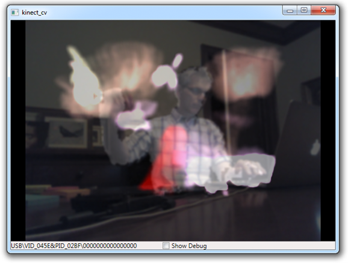

#kinect_cv: Kinect Image Processing Demo for GRAND 2014 Kinect Workshop

Demonstrates how to use the Kinect for Windows SDK and Emgu CV for real time image processing leveraging skeleton positions in C#.




## Requirements

* Windows 7+ (tested on Windows 7 and 8.1)
* Kinect for Windows sensor or Kinect for Xbox sensor
* Visual Studio 2010 or Visual C# Express 2010 
* The Emgu CV .Net wrapper for OpenCV
* Official Kinect SDK v1.8

**Using a virtual machine to run Windows on OSX or Linux?**
Only the Kinect for Windows sensor will work on a virtual machine. Kinect for Xbox sensors are not supported in virtual machines.
http://msdn.microsoft.com/en-us/library/jj663795.aspx

## Required Software Setup

Download and install *Visual C# Express 2010*:  
http://www.visualstudio.com/en-us/downloads#d-2010-express

Download and install the *Kinect for Windows 1.8 SDK and Developer Toolkit*:  
http://www.microsoft.com/en-us/kinectforwindowsdev/Downloads.aspx

Download and install *Emgu 2.9.0 for Windows*:  
http://sourceforge.net/projects/emgucv/files/emgucv/2.4.9-beta/libemgucv-windows-universal-cuda-2.9.0.1922-beta.exe/download

## Setup Kinect

Plug in the Kinect and let all the drivers install.

Test the Kinect by running:  
"C:\Program Files\Microsoft SDKs\Kinect\Developer Toolkit v1.8.0\KinectExplorer-WPF.exe"


## Compiling and Running the Code for the First Time

1. You may need to set the reference path to your Emgu installation: Add "C:\Emgu\emgucv-windows-universal-cuda 2.9.0.1922\bin\" to "Project Properties"/"Reference Paths".
2. Compile the solution.
3. Before running, go to "C:\Emgu\emgucv-windows-universal-cuda 2.9.0.1922\bin\" and copy the "\x64" and "\x86" subdirectories containing all the OpenCV DLLs (~1Gb) to the "Debug\" subdirectory of the kinect_cv project. Do the same for "Release\" if you want to compile release code.

**Crash on start with exceptions shown below? Make sure you copied the OpenCV DLL directories in step 3.**

```
A first chance exception of type 'System.ArgumentException' occurred in mscorlib.dll
A first chance exception of type 'System.DllNotFoundException' occurred in Emgu.CV.dll
A first chance exception of type 'System.TypeInitializationException' occurred in Emgu.CV.dll
```

## Understanding the Demo

Comments in the code and discussion at the workshop.

## Contact

Question? Bugs? Contact me.
